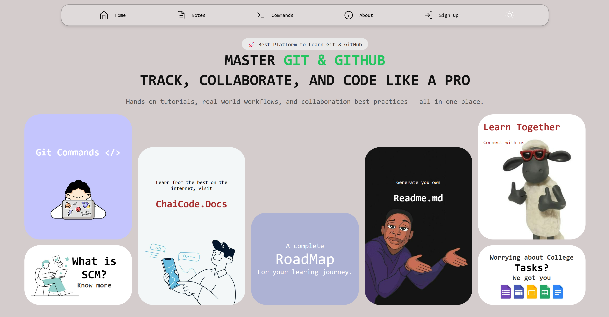
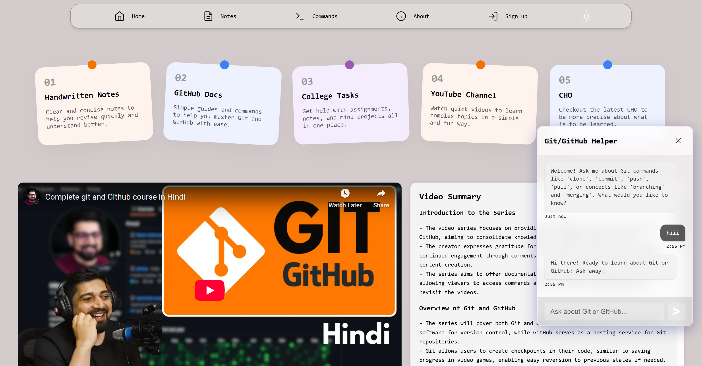
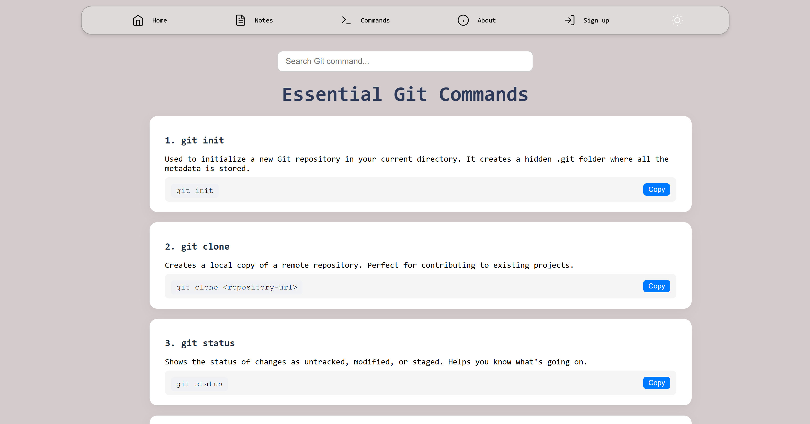

# 🚀 GitInsights

**Master Git & GitHub: Track, Collaborate, and Code Like a Pro**

[🔗 Live Website](https://gitinsights-beta.vercel.app/)

GitInsights is a learning and collaboration platform built to simplify the process of understanding Git and GitHub. Whether you're a beginner or looking to polish your skills, this platform walks you through Git concepts, commands, team workflows, SCM practices, and even helps you generate your own `README.md`.

---

## 📚 Features Overview

| Feature                 | Description                                                                 |
|------------------------|-----------------------------------------------------------------------------|
| 📒 Notes               | Learn core Git concepts and Source Code Management (SCM) principles         |
| 💻 Git Commands         | Interactive section explaining real-world Git commands                      |
| 📄 README.md Generator | Instantly create structured README files for your projects                   |
| 🧑‍🤝‍🧑 Team Section         | Explore the developers and contributors behind GitInsights                |
| 🌗 Light/Dark Mode      | Toggle themes for personalized viewing experience                          |
| 📱 Fully Responsive     | Optimized for mobile, tablet, and desktop experiences                       |

---

## 👨‍💻 Collaborators

Meet the team behind GitInsights:

| Name       | GitHub                           | LinkedIn                        |
|------------|----------------------------------|----------------------------------|
| **Abhishek**   | [GitHub](https://github.com/abhishekkksharma) | [LinkedIn](https://linkedin.com) |
| **Aman Singh** | [GitHub](https://github.com)               | [LinkedIn](https://linkedin.com) |
| **Addy**       | [GitHub](https://github.com)               | [LinkedIn](https://linkedin.com) |
| **Mridul**     | [GitHub](https://github.com)               | [LinkedIn](https://linkedin.com) |

> Developed as a team project for learning Source Code Management & collaboration.

---

## 📸 Screenshots

### 🏠 Home Page

### 📘 Notes Page

### 📄 Commands list page

---

